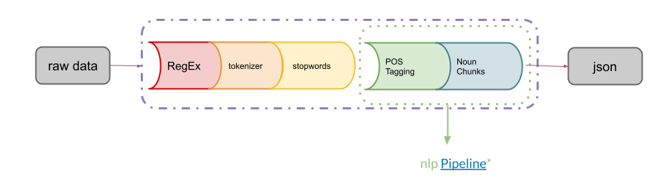

# Knowledge Discovery
This repository is containing an university related python project for the course adaptive systems and artificial intelligence.

The goal of the project is to collect data from specific university websites in Germany in order to analyze and categorize the different courses by using a combination of Scrapy, NLP, SciKit or GenSim and LDA.
In the end the analysis shall give an overview about the different topics and how they are distributed.


Note: As this project is a prototype only, there still might be contradictions regarding the scraped and processed datas.

## Scraping Data ##

This project uses [Scrapy](https://scrapy.org/) to retrieve data from several Websites. To do so every college has its own spider that scrapes the course data and saves it in a ```.json```-File.

Go to ```main.py``` and comment one ```spider```, ```process.crawl``` and ```write_json``` in and run the main. Repeat the process for each college.

You'll find the crawled Data in ```Resources/```

## Cleaning Data ##
This project uses the [NLTK](https://www.nltk.org/) and [SpaCy](https://spacy.io/) to preprocess the data. We chose these libraries because they provide pre-trained models for the German language. 


In the Cleaning Data Folder run ```cleanData.py``` to get the preprocessed ```.json``` output, that is saved in ```Resources/Cleaned```. 

## Data Processing ##
Inside the LDA Folder you'll find different scripts to handle or visualize the data. This project uses the LDA algorithm for topic recognition.

* ```gensimTEST.py```: Using the LDA Algorithm with [GenSim](https://radimrehurek.com/gensim/) to generate output data for every college and saves it in ```/GensimOutput```
* ```scikit_LDA.py```: Using the LDA Algorithm with [SciKit Learn](https://scikit-learn.org/stable/index.html) to generate output data for every collge and saves it in ```/SkLearnOutput```
* ```plot.py```: using the LDA algorithm from SciKit to scatter plot the data with matplotlib. It is also possible to add PCA. Plots are saved in ```/Plot```
* ```kmeans.py```: by using TF-IDF, PCA and a k-Means Model from SciKit Learn clusters are created and saved  in ```/Plot/Kmeans```
* to run the visualizations with what we imagined to be ideal data use ```kmeansPlay.py``` or ```plotPlay.py```


